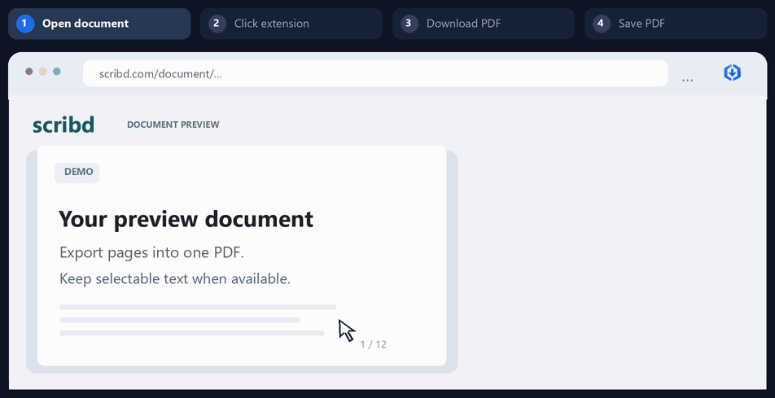

<div align="center">


# Scribd Preview to PDF

**Export Scribd pages into PDF — directly in your browser.**

[](../../releases/latest)
[](#installation)
[](LICENSE)
[](#privacy-and-permissions)
[](https://buymeacoffee.com/ergs02046)

**No manual scrolling · No copied tokens · No OCR service · No external processing**


[Download the latest release](../../releases/latest) · [Report a bug](../../issues/new)

</div>

> [!IMPORTANT]
> This project is not affiliated with or endorsed by Scribd. Only export content you are authorized to access and save, and respect copyright law and Scribd's terms.

---

## Demo


<div align="center">
  
</div>

Open a supported Scribd document, click the extension, and start the export.

The extension discovers the available pages, reconstructs them locally, preserves selectable text when possible, and saves the finished PDF through your browser.

## Features

- **One-click PDF export** — Start directly from the extension popup.
- **No manual scrolling** — Discovers available pages from Scribd's built-in document manifest.
- **Accurate page reconstruction** — Preserves page order, dimensions, and clipped image-sprite layout.
- **Selectable text when available** — Keeps Scribd's own text layer and decodes supported scrambled subset fonts without OCR.
- **Background processing** — Close the popup while rendering continues, then reopen it to check progress.
- **Download queue** — Queue multiple documents and process them one at a time without duplicates.
- **Automatic retries** — Fetches page assets concurrently and retries temporary failures.
- **Local processing** — Page reconstruction and PDF assembly happen entirely in your browser.
- **No analytics or telemetry** — No advertising SDK, tracking service, or external document-processing API.

## Requirements

- Google Chrome or Microsoft Edge with Manifest V3 extension support
- A Scribd document or preview that is accessible in your current browser session
- Enough memory for the final PDF; very large image-heavy books can require substantial RAM

## Installation

### Recommended: GitHub Release

1. Open the [latest release](../../releases/latest).
2. Download the extension `.zip` file attached to the release.
3. Extract it to a permanent folder.
4. Do **not** load the ZIP file directly.
5. Open:
   - `chrome://extensions` in Google Chrome, or
   - `edge://extensions` in Microsoft Edge.
6. Enable **Developer mode**.
7. Click **Load unpacked**.
8. Select the extracted extension folder.
9. Pin **Scribd Preview to PDF** to your browser toolbar.

### From source

```bash
git clone https://github.com/ergs0204/scribd-pdf-downloader.git
cd scribd-pdf-downloader
```

Then load the repository folder as an unpacked extension.

There is no build step and no package installation is required.

## Usage

1. Open one of these:
   - `https://www.scribd.com/document/<id>/<title>`
   - `https://www.scribd.com/doc/<id>/<title>`
   - [scribdvdownloader.com](https://scribdvdownloader.com/) after it opens the document preview
   - Any other website containing a Scribd preview frame
2. Wait until the document page or preview is visible.
3. Click the extension icon.
4. Click **Download all pages as PDF**.
5. Close or reopen the popup whenever you like. Rendering continues in the hidden extension document.
6. To add another document, open its Scribd page and click **Add this document to queue**. Queued documents render in order.
7. When each assembly finishes, choose where to save the PDF.

No page-by-page scrolling is required.

## What the progress states mean

| State | Meaning |
| --- | --- |
| Finding | Detecting an official Scribd document or embedded preview |
| Preparing | Reading the page manifest and requesting a fresh token through the current Scribd session |
| Rendering | Fetching and reconstructing pages with six concurrent workers |
| Assembling | Building the ordered PDF and Unicode text map |
| Saving | Opening the browser's normal Save dialog |
| Complete | The download has started |

The popup also reports:

- rendered page count
- selectable-text page count
- decoded custom-font text
- failed pages
- unresolved text that could not be decoded reliably

## How it works

1. **Document detection** - Finds an official Scribd `/doc/` or `/document/` page, or an `/embeds/.../content` frame.
2. **Manifest parsing** - Reads each `docManager.addPage(...)` entry. This exposes every authorized page without scrolling.
3. **Session token refresh** - Uses Scribd's CSRF and document-token endpoints in your existing browser session.
4. **Concurrent page loading** - Fetches JSONP page descriptions and their authorized assets with retries.
5. **Page reconstruction** - Draws each clipped image sprite into its correct page coordinates.
6. **Built-in text preservation** - Reads Scribd's positioned `text_layer` and supplied subset-font character maps. For supported scrambled fonts, glyph ordering recovers a unique document-specific character permutation. Original codes still draw the visual page; decoded Unicode goes into the invisible PDF layer for selection and copying.
7. **Local PDF assembly** - Creates the final PDF in a hidden extension document and hands it to the browser download manager.

The extension does not create a headless Scribd session, scrape your cookies, upload documents to another service, or run OCR.

## Text and image behavior

Scribd documents are not all stored the same way:

| Scribd page data | PDF result |
| --- | --- |
| Scanned image or image sprites only | Visually reconstructed image page; text is not selectable |
| Image plus Scribd text layer | Reconstructed image with selectable built-in text overlay |
| Scribd text/vector layer | Text rendered visually with a selectable Unicode layer |
| Supported Scribd scrambled subset font | Original visual glyphs plus readable, selectable text decoded from the supplied font metadata |
| Unresolved custom font or private-use symbol | Visual appearance preserved; unresolved fragments omitted from copying |

If Scribd does not provide text for a scanned page, this extension does not invent it. Use a separate OCR tool afterward if you personally need searchable scans.

## Permissions and privacy

| Permission | Why it is needed |
| --- | --- |
| `www.scribd.com` | Detect the document, read the authorized manifest, and refresh the page token |
| `html.scribdassets.com` | Fetch authorized page descriptions, images, and fonts |
| Downloads | Save the completed PDF |
| Tabs / webNavigation / scripting | Find official pages and cross-origin embedded previews |
| Offscreen | Keep rendering after the popup closes without opening a separate progress tab |
| Storage | Keep global progress available when the popup is reopened |

No analytics, advertising SDK, external API, or telemetry is included.

## Limitations

- Only pages authorized by Scribd for the active browser session can be requested.
- Signed asset tokens expire; start each export from a live document page.
- Very large documents are assembled in browser memory and may exceed available RAM.
- Unusual vertical or mathematical layouts may render differently from the source.
- Font decoding currently supports a shared low-nibble permutation in the ASCII range `0x30–0x6F`, recoverable from Unicode SFNT cmap formats 4/12 and subset glyph order. It is not a universal decoder for every font encoding. Unsupported fonts or ambiguous mappings are omitted from the copy layer, with a popup warning.
- Private-use symbol glyphs can remain visible without a copyable equivalent. Text contained only inside images remains image-only.
- Selectable text quality and reading order depend on Scribd's positioned fragments; this does not reconstruct semantic paragraphs or fix source typos.
- Site changes can break manifest or token parsing; open an issue with non-sensitive reproduction details if that happens.

## Troubleshooting

### "No supported Scribd document was detected"

- Confirm the URL starts with `https://www.scribd.com/doc/` or `https://www.scribd.com/document/`.
- On [scribdvdownloader.com](https://scribdvdownloader.com/) or another third-party site, wait until the embedded Scribd preview appears.
- Reload the page after installing or updating the extension.
- Confirm the installed extension version matches the latest release.

### The popup closes

That is fine. Rendering continues in the hidden extension document. Click the extension icon again to restore the current global progress.

### A page fails repeatedly

- Keep the Scribd tab open.
- Confirm the document is still accessible in the current session.
- Reload the page and begin a new export so the extension receives a fresh signed token.

### Text cannot be selected

The page may be image-only, or its custom font may not have a reliable decoder. Check the popup's selectable/decoded page counts and unresolved-text warning. This project intentionally does not run OCR.

### Copied text is still garbled in an old PDF

Reload the extension and confirm version **1.4.4** or newer, reload the document tab, then export a new PDF. Updating the extension does not repair files downloaded with an older version.

## Development

The extension is plain Manifest V3 JavaScript with no build system and no runtime dependencies.

```text
scribd-preview-to-pdf/
├── manifest.json       Extension metadata and permissions
├── popup.*             Start button and persistent global progress
├── content.js          Official-page/embed manifest and token reader
├── background.js       Job state, offscreen renderer, and downloads
├── builder.*           Page reconstruction and PDF/text-layer writer
└── README.md
```

After editing, reload the unpacked extension from `chrome://extensions` and test both an official document URL and an embedded preview.

## Contributing

This started as a small personal utility, so rough edges are expected. Focused bug reports and small pull requests are welcome. Never include Scribd cookies, CSRF tokens, signed asset URLs, or copyrighted page data in an issue.

## Support

If this quick personal tool saves you time, you can [buy me a coffee](https://buymeacoffee.com/ergs02046). Support is appreciated but never required.

## License

Released under the [MIT License](LICENSE).

## Disclaimer

This software is provided for personal and educational use. It is a convenience tool for exporting material that Scribd already makes available to your current browser session. It does not grant access to restricted pages, remove DRM, or confer permission to reproduce or distribute documents. You are solely responsible for using it lawfully and respecting authors, publishers, copyright, and platform terms.

---

<div align="center">

Built with Codex, tested against official and embedded Scribd page manifests, and shared as-is for personal use.

</div>
